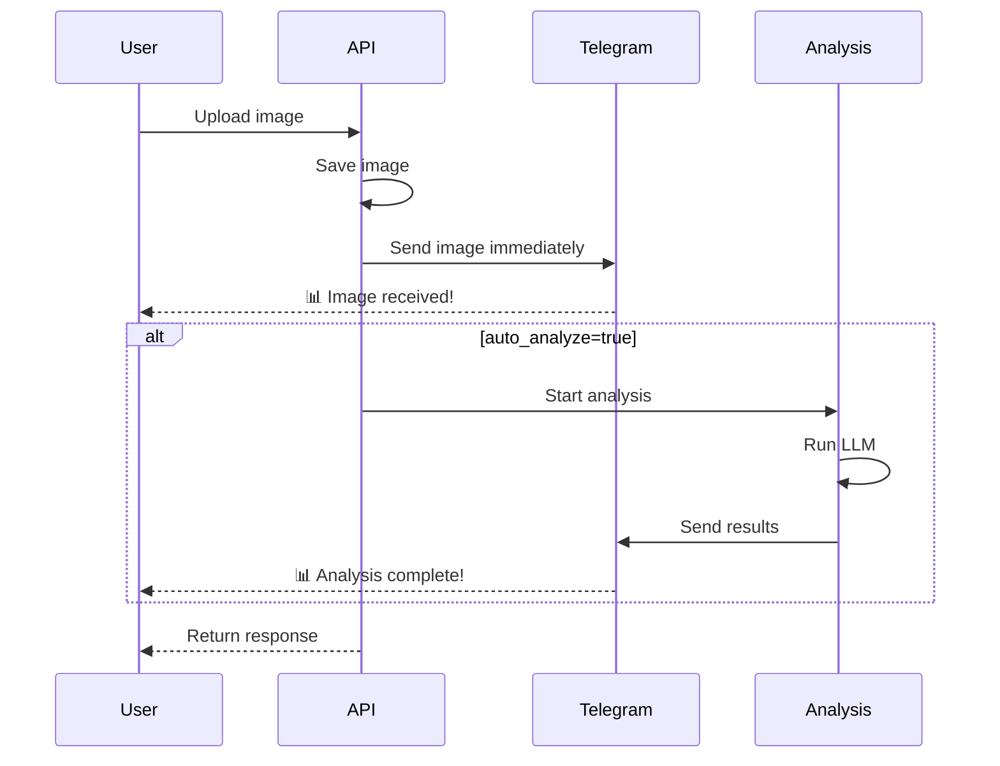

# Telegram Integration - Changes Log

## Summary

Telegram integration has been successfully added to your Trading Assistant. When images are uploaded to the endpoint, they are immediately sent to Telegram along with the analysis results when completed.

## Changes Made

### 1. Core Service Updates

#### `services/notification_service.py`
- ✅ Added Telegram bot token and chat ID configuration
- ✅ Added `_send_telegram_notification()` method for text messages
- ✅ Added `send_telegram_image()` method for sending images with captions
- ✅ Added `send_telegram_analysis()` method for sending analysis with charts
- ✅ Updated `send_trade_notification()` to include Telegram
- ✅ Added convenience functions: `send_image_to_telegram()` and `send_analysis_to_telegram()`
- ✅ Updated test functions to show Telegram status

#### `web_app.py`
- ✅ Imported Telegram notification functions
- ✅ Updated `/api/upload-image` endpoint to send images to Telegram immediately
- ✅ Added `telegram_sent` status to API response
- ✅ Updated analysis thread to send results to Telegram after completion
- ✅ Updated notification status displays to include Telegram

#### `app.py`
- ✅ Updated notification displays to show Telegram status (✅/❌)
- ✅ Included Telegram in both valid and invalidated trade notifications

### 2. New Files Created

#### Documentation Files

1. **`TELEGRAM_SETUP.md`** (Comprehensive Setup Guide)
   - Step-by-step instructions for creating a Telegram bot
   - How to get your chat ID
   - Configuration examples
   - Troubleshooting section
   - Benefits and features overview

2. **`TELEGRAM_QUICK_START.md`** (Quick Reference)
   - 5-minute setup guide
   - Quick test instructions
   - Common usage examples
   - One-page reference

3. **`TELEGRAM_INTEGRATION_SUMMARY.md`** (Technical Overview)
   - Complete technical documentation
   - API response examples
   - Flow diagrams
   - File changes summary

4. **`CHANGES_TELEGRAM.md`** (This file)
   - Complete changelog
   - Testing instructions
   - Next steps

#### Test & Example Files

5. **`test_telegram.py`** (Test Script)
   - Comprehensive test suite
   - Tests text messages, images, and analysis
   - Detailed diagnostics and troubleshooting
   - Executable script with clear output

6. **`example_telegram_upload.py`** (Usage Example)
   - Practical example of using the API
   - Demonstrates image upload with Telegram
   - Shows how to check Telegram status
   - Can be run with or without arguments

### 3. Updated Documentation

#### `NOTIFICATION_SETUP.md`
- ✅ Added Telegram as Option 1 (recommended for images)
- ✅ Added reference to detailed Telegram setup guide
- ✅ Renumbered other options (Pushover = 2, Email = 3)

#### `START_HERE.md`
- ✅ Added links to Telegram documentation
- ✅ Updated documentation section with Telegram references

## Configuration Required

Add to your `.env` file:

```bash
# Telegram Configuration
TELEGRAM_BOT_TOKEN=your_bot_token_here
TELEGRAM_CHAT_ID=your_chat_id_here
```

## Testing Instructions

### Test 1: Verify Configuration
```bash
python test_telegram.py
```
Should show:
- ✅ Configuration check
- ✅ Text message test
- ✅ Image message test
- ✅ Analysis message test

### Test 2: Upload via Example Script
```bash
python example_telegram_upload.py BTCUSDT.P_2025-09-02_22-55-40_545b4.png
```
Should:
- Upload the image
- Send to Telegram immediately
- Start analysis (if auto_analyze=true)
- Send analysis results to Telegram

### Test 3: Upload via Web Interface
```bash
./start_server.sh
open upload_example.html
```
Upload a chart and check Telegram!

### Test 4: Upload via API
```bash
curl -X POST http://localhost:5001/api/upload-image \
  -F "image=@BTCUSDT.P_2025-09-02_22-55-40_545b4.png" \
  -F "auto_analyze=true"
```

## What Happens When You Upload



## API Response Changes

The `/api/upload-image` endpoint now returns:

```json
{
  "success": true,
  "message": "Image uploaded successfully",
  "telegram_sent": true,  // NEW: Telegram status
  "metadata": {
    "filename": "trading_chart_20250131_143022.png",
    "size_kb": 245.67,
    "timestamp": "20250131_143022"
  }
}
```

## Messages You'll Receive in Telegram

### 1. Upload Notification (Immediate)
```
📊 New Trading Chart Uploaded

Filename: trading_chart_20250131_143022.png
Size: 245.67 KB
Time: 20250131_143022
```
+ Chart image attached

### 2. Analysis Results (After processing)
```
📊 Trading Chart Analysis

Symbol: BTCUSDT
Timeframe: 1h
Direction: LONG
Confidence: 85.0%

Analysis complete!
```
+ Chart image attached

### 3. Valid Trade Signal
```
🚀 VALID TRADE SIGNAL

📊 Symbol: BTCUSDT
📈 Direction: LONG
💰 Price: $50,000.00
📊 RSI: 45.2
🎯 Confidence: 85%

✅ Trade approved by AI gate
⏰ Time: 2025-01-31 15:30:45

Check your trading platform!
```

### 4. Invalidated Trade
```
❌ TRADE INVALIDATED

📊 Symbol: BTCUSDT
💰 Price: $50,250.00
⚠️ Triggered Conditions: RSI exceeded 70

❌ Trade signal no longer valid
⏰ Time: 2025-01-31 15:35:45
```

## Benefits

✅ **Instant Visual Feedback** - See charts immediately
✅ **Rich Formatting** - HTML formatting with emojis
✅ **Cross-Platform** - Works everywhere Telegram works
✅ **Message History** - All notifications saved
✅ **Multiple Channels** - Works with Pushover and Email simultaneously
✅ **No Additional Cost** - Telegram is free
✅ **Easy Setup** - 3 steps, 5 minutes

## File Structure

```
/Users/hpk/trassist2/
├── services/
│   └── notification_service.py      (MODIFIED - Added Telegram)
├── app.py                           (MODIFIED - Updated notifications)
├── web_app.py                       (MODIFIED - Added Telegram integration)
├── TELEGRAM_SETUP.md                (NEW - Detailed setup guide)
├── TELEGRAM_QUICK_START.md          (NEW - Quick reference)
├── TELEGRAM_INTEGRATION_SUMMARY.md  (NEW - Technical overview)
├── CHANGES_TELEGRAM.md              (NEW - This file)
├── test_telegram.py                 (NEW - Test script)
├── example_telegram_upload.py       (NEW - Usage example)
├── NOTIFICATION_SETUP.md            (UPDATED - Added Telegram)
└── START_HERE.md                    (UPDATED - Added references)
```

## Next Steps

1. **Setup Telegram** (5 minutes)
   ```bash
   # See TELEGRAM_QUICK_START.md for fastest setup
   # See TELEGRAM_SETUP.md for detailed instructions
   ```

2. **Test Integration** (1 minute)
   ```bash
   python test_telegram.py
   ```

3. **Upload a Chart** (30 seconds)
   ```bash
   python example_telegram_upload.py your_chart.png
   ```

4. **Check Telegram** ✅
   - You should see your chart image
   - You should see analysis results

## Troubleshooting

### Quick Fixes

1. **Not receiving messages?**
   - Check `.env` file has both `TELEGRAM_BOT_TOKEN` and `TELEGRAM_CHAT_ID`
   - Restart the server: `./start_server.sh`
   - Run test: `python test_telegram.py`

2. **Server error?**
   - Make sure server is running: `./start_server.sh`
   - Check port 5001 is available: `lsof -ti:5001`

3. **Bot not responding?**
   - Start a chat with your bot first (send `/start`)
   - Verify token with: `https://api.telegram.org/botYOUR_TOKEN/getMe`
   - Verify chat ID with: `@userinfobot`

### Detailed Troubleshooting

See `TELEGRAM_SETUP.md` for comprehensive troubleshooting guide.

## Compatibility

- ✅ Works with existing Pushover notifications
- ✅ Works with existing Email notifications
- ✅ Works with all upload methods (web, API, cURL)
- ✅ Works with auto_analyze feature
- ✅ Works with save_permanently feature
- ✅ No breaking changes to existing functionality

## Environment Variables Summary

```bash
# Required for Telegram
TELEGRAM_BOT_TOKEN=123456789:ABCdefGHIjklMNOpqrsTUVwxyz
TELEGRAM_CHAT_ID=987654321

# Optional (existing configurations)
PUSHOVER_TOKEN=your_pushover_token
PUSHOVER_USER=your_pushover_user
EMAIL_USERNAME=your_email@gmail.com
EMAIL_PASSWORD=your_app_password
EMAIL_TO=recipient@example.com
```

## Support

- **Setup Help**: `TELEGRAM_SETUP.md`
- **Quick Start**: `TELEGRAM_QUICK_START.md`
- **Technical Details**: `TELEGRAM_INTEGRATION_SUMMARY.md`
- **Test Issues**: Run `python test_telegram.py` for diagnostics

---

## Summary

🎉 **Telegram integration is complete and ready to use!**

- ✅ All code changes implemented
- ✅ Documentation created
- ✅ Test scripts ready
- ✅ Examples provided
- ✅ No linter errors

**To start using:** Follow `TELEGRAM_QUICK_START.md` (5 minutes)

